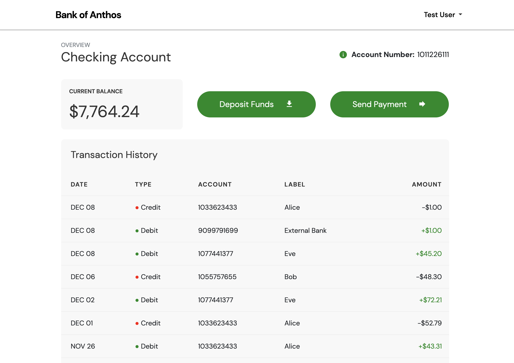
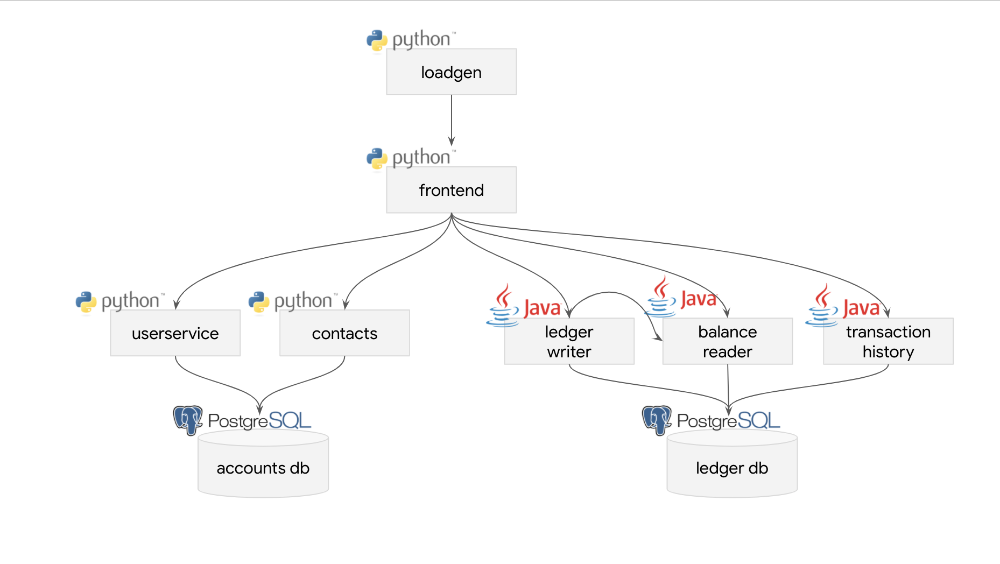

# Tiho Banking Platform

Cloud-native retail banking microservices — application code and Kubernetes deployment manifests. Designed to run on local [Kind](https://kind.sigs.k8s.io) clusters and, later, EKS, GKE, and AKS via GitOps.

> **Upstream:** Application services are derived from [Bank of Anthos](https://github.com/GoogleCloudPlatform/bank-of-anthos) (Apache-2.0).  
> **Platform:** This repo is the **app + deploy** only. Bring a Kubernetes cluster (usually Kind) with the add-ons each overlay needs. Cluster bootstrap is out of tree — see [docs/TODO.md](docs/TODO.md) for a planned public platform reference.

## Screenshots

Demo UI (upstream Bank of Anthos branding — same application flow on Kind/GKE with this repo’s deploy overlays):

| Sign in | Home |
| ------- | ---- |
| [](docs/img/login.png) | [](docs/img/transactions.png) |

Demo login: `testuser` / `bankofanthos`

## Service architecture



*Diagram from [Bank of Anthos](https://github.com/GoogleCloudPlatform/bank-of-anthos) (Apache-2.0). Python services use Dockerfiles; Java ledger services use Jib. This repo centralizes Kubernetes manifests under `deploy/`.*

## Repository layout

```
.
├── src/                      # Microservice source (build artifacts)
├── deploy/
│   ├── base/                 # Shared Kubernetes manifests
│   ├── components/           # Reusable Kustomize patches
│   └── overlays/
│       ├── kind-local/              # Istio sidecar + classic Gateway/VS
│       ├── kind-local-gateway-api/  # Sidecar + Kubernetes Gateway API
│       ├── kind-local-ambient/      # Istio ambient + waypoint
│       ├── kind-local-ambient-cnpg/ # Ambient + CloudNativePG
│       └── gke-dev/                 # GKE-shaped (upstream-style)
├── docs/                     # Architecture, upstream, TODO
├── LICENSE                   # Apache-2.0 (from upstream)
└── NOTICE                    # Attribution (BoA + this repo)
```

| Directory | Purpose |
|-----------|---------|
| `src/` | Python + Java services, Dockerfiles / Jib. **No** per-service `k8s/` or Cloud Build. |
| `deploy/base/` | Full application stack (from upstream `kubernetes-manifests/`). |
| `deploy/components/` | Portable patches (JWT, telemetry, Gateway API, CNPG, …). |
| `deploy/overlays/` | Per-target Kind / GKE compose — full list in [deploy/README.md](deploy/README.md). |

## Services

| Service | Path | Language |
|---------|------|----------|
| Frontend | `src/frontend` | Python |
| User service | `src/accounts/userservice` | Python |
| Contacts | `src/accounts/contacts` | Python |
| Balance reader | `src/ledger/balancereader` | Java |
| Ledger writer | `src/ledger/ledgerwriter` | Java |
| Transaction history | `src/ledger/transactionhistory` | Java |
| Accounts DB | `src/accounts/accounts-db` | PostgreSQL image |
| Ledger DB | `src/ledger/ledger-db` | PostgreSQL image |
| Load generator | `src/loadgenerator` | Python / Locust (optional) |

See [docs/architecture.md](docs/architecture.md) for request flows and auth.

## Status

| Phase | State |
|-------|--------|
| Application code (`src/`) | Ready — cleaned for GitOps layout |
| Deploy (`deploy/base` + Kind/GKE overlays) | **Ready** — Kustomize; Istio VS, Gateway API, ambient, CNPG paths; upstream images `v0.6.9` |
| CI (GitHub Actions) | **Present** — path-filtered per service; `deploy-validate` builds all overlays |
| GitOps (Flux) | Planned — reconcile an overlay from a platform GitOps repo |

## Quick start (Kind)

Prerequisites: a **Kind cluster** with whatever the chosen overlay needs (see [deploy/README.md](deploy/README.md) — e.g. Istio + MetalLB for `kind-local`, Gateway API CRDs + a `GatewayClass` for `kind-local-gateway-api`).

```bash
kubectl apply -k deploy/overlays/kind-local
# or: deploy/overlays/kind-local-gateway-api
kubectl wait --for=condition=Available deployment --all -n banking-platform --timeout=300s
```

See [deploy/README.md](deploy/README.md) for the full deploy guide (all environments — not only Kind).

Demo login (upstream defaults): `testuser` / `bankofanthos`

## Documentation

- [docs/README.md](docs/README.md) — documentation index
- [docs/architecture.md](docs/architecture.md) — services, auth, data flow, deploy options
- [docs/upstream.md](docs/upstream.md) — attribution and syncing from Bank of Anthos
- [docs/TODO.md](docs/TODO.md) — follow-ups (public platform repo, ESO, …)
- Per-service READMEs under `src/*/README.md` — upstream service notes (kept for code navigation)

## What was removed from upstream `src/`

These belong to Google’s per-service Skaffold / Cloud Build pipeline, not this GitOps layout:

- `src/**/k8s/` — per-service Kustomize (replaced by `deploy/`)
- `src/**/skaffold.yaml`, `src/**/cloudbuild.yaml`
- `src/components/` — Kustomize components for upstream per-service deploy
- `src/ledgermonolith/` — VM monolith demo (out of scope for Kubernetes GitOps)
